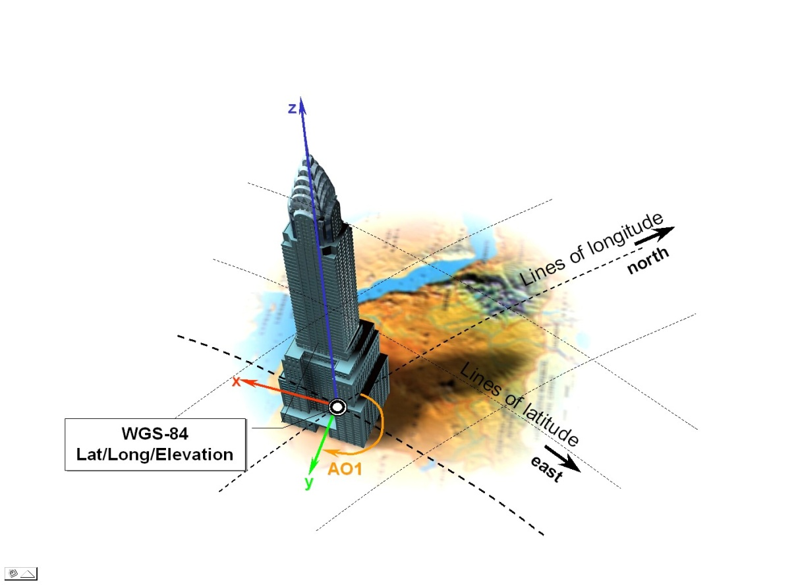

== CDB Approach

One of the primary objectives of the CDB standard is to provide the means to represent the entire earth. As such, a CDB compliant data store must handle spatial data with a good deal of rigor to accurately describe the position of points in space and must do so at the level of fidelity commensurate with the precision that is now possible in modern simulators.

The size, content, fidelity and precision of synthetic environments now warrant a different approach, an approach that entirely avoids the “problem with projections” and other approximations used in the past. To this end, the CDB standard mandates the use a *geographic coordinate system* (GCS). A GCS uses a three-dimensional spherical surface to define locations on the earth. Since no projections are involved, full geometric coherence is assured without compromise and all four key spatial properties can be achieved simultaneously:

1.  Preservation of distance
2.  Preservation of direction
3.  Preservation of area
4.  Preservation of shape

=== CDB Spatial Reference Systems

The CDB standard is based on a surface geodetic coordinate system, i.e., points on the earth surface are specified as geographic latitude -longitude and elevation coordinates. More specifically, geodetic coordinates (sometimes called geographic coordinates) are angular coordinates (longitude and latitude), closely related to spherical polar coordinates, and are defined relative to a particular Earth geodetic datum. For the CDB, this is the WGS 84 datum. The WGS 84 datum surface is an https://en.wikipedia.org/wiki/Oblate_spheroid[oblate spheroid] (ellipsoid) with major (equatorial) radius _a_ = 6378137 m at the https://en.wikipedia.org/wiki/Equator[equator] and https://en.wikipedia.org/wiki/Flattening[flattening] _f_ = 1/298.257223563 footnote:[https://en.wikipedia.org/wiki/World_Geodetic_System#cite_note-Third_Edition_2000-6]. The polar semi-minor axis _b_ then equals _a_ times (1−__f__), or 6356752.3142 m.

The CDB data store embeds modeled point features (e.g., the representation of 3-D objects, moving and/or static) within a Cartesian Coordinate System footnote:[A Cartesian coordinate system is a https://en.wikipedia.org/wiki/Coordinate_system[coordinate system] that specifies each https://en.wikipedia.org/wiki/Point_%28geometry%29[point] uniquely in a https://en.wikipedia.org/wiki/Plane_%28geometry%29[plane] by a pair of https://en.wikipedia.org/wiki/Number[numerical] *coordinates*, which are the https://en.wikipedia.org/wiki/Positive_and_negative_numbers[signed] distances to the point from two fixed https://en.wikipedia.org/wiki/Perpendicular[perpendicular] directed lines, measured in the same https://en.wikipedia.org/wiki/Unit_length[unit of length]]. Its use is generally constrained to objects that are small in comparison to the earth. As shown below, a modeled point feature can be referenced anywhere on the earth by providing the model’s orientation (the AO1 attribute specified in Chapter 5 of Volume 1: OGC CDB Core Standard: Model and Physical Database Structure) and the model’s origin using a set of latitude/longitude/elevation coordinates. Note that the model’s z-axis implicitly points upward with respect to the earth surface.

Figure 1: Cartesian Model positioned to WGS-84 Coordinates

The earth shape is described by the WGS-84 reference ellipsoid. The CDB standard also defines three related set of Spatial Reference Systems (and associated coordinate systems) for use in conjunction with the surface geodetic coordinate system; they are:

1.  Earth-centered Cartesian (Geocentric)
2.  Generic Cartesian
3.  Local Vertical (LVCS)
