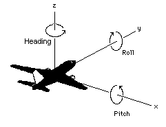
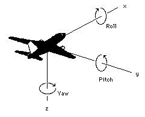

== The Three Systems

The following sections detail the normative aspects of the three Spatial Reference Systems (SRS) supported in the CDB model. We start with a general discussion of the Geographical Coordinate System before addressing the Spatial Reference Systems.

=== Geographic Coordinate System (Geodetic)

A geographic coordinate system (also called the geodetic coordinate system) is one in which the coordinates are expressed as latitude, longitude, and altitude relative to the reference ellipsoid. Geographical latitude _φ_ and longitude _λ_ are the angles of the normal on the reference ellipsoid along the point to the equator and zero meridian. The angles are normally given as degrees, minutes and seconds. Altitude is the distance above and normal to the reference ellipsoid in meters. The WGS 84 ellipsoid represents the actual geoid within an accuracy of 100 meters. The prime meridian and the equator are the reference planes used to define latitude and longitude.

In other terms, the geographic latitude – there are many other defined latitudes – of a point is the angle between the equatorial plane and a line normal to the reference ellipsoid’s surface. The geographic longitude of a point is the angle between a reference plane, Greenwich, and a plane passing through the point, both planes being perpendicular to the equatorial plane. The geographic height at a point is the distance from the reference ellipsoid to the point in a direction normal to the reference ellipsoid. 

*Table 1: Geographic Coordinate System (Geodetic)*

[cols=",",]
|======================================================================================================
|*Field* |*Specification*
|Properties |Orthogonal.
|CS parameters and constraints a|
_a_: major semi-axis length

_b_: minor semi-axis length

Constraints: _a_ > _b_: (oblate ellipsoid)

|Coordinate components a|
_λ_ : longitude in radians, and

_φ_ : geodetic latitude in radians.

|Domain of the generating function or mapping equations a| image::images/math1.png[width=150]
|Domain of the inverse of the generating function or mapping equations a| image::images/math2.png[width=300]
|Notes a|
1.  The CS surface is the oblate ellipsoid (or sphere) surface excluding the pole points.
2.  The geodetic 3D CS induces this CS on the 3^rd^ coordinate surface at any point for which _h_ = 0.
3.  If a = b, the geodetic latitude φ coincides with the spherical latitude θ.
4.  For WGS-84 a= 6,378,137 m and b = 6,356,752 m. The inverse flattening ratio f^-1^ is 298.257223563.

|======================================================================================================

==== Earth-Centered SRS (aka Rectangular Geocentric SRS)

The earth-centered SRS defines a three-dimensional Euclidian space with respect to the geometric center of the reference ellipsoid, the center of the earth. The reference datum of the Earth-centered SRS is based on the WGS-84 ellipsoid reference model. In this SRS, the z-axis is pointing at the North Pole, the x-axis is pointing at the intersection of the equator and the Greenwich meridian, the prime meridian, and the y-axis is pointing at the intersection of the equator and 90^o^ east longitude. The associated coordinate system is called the World Coordinate System and its units are meters. The world coordinate system is used to specify the 3D position of objects with respect to the earth-centered SRS. This coordinate system is used as an intermediate system to convert geodetic coordinates to LVCS and vice versa

==== General Cartesian SRS

The Cartesian spatial reference frame defines a three-dimensional Euclidian space with respect to an arbitrary origin. The reference datum specifying the origin and the orientation of the SRS is arbitrary, i.e. the reference datum can be specified within a geocentric SRS, a LVCS SRS or any other SRS. The SRS is right-handed and orthonormal. In this SRS system, the z-axis is pointing up and both the x-axis and y-axis lie in the horizontal plane. The associated coordinate system is called the General Cartesian Coordinate System; coordinates are specified in meters. This coordinate system is used for the representation of 3-D objects, moving and/or static. Its use is generally constrained to objects that are small in comparison to the earth footnote:[To ensure that the object preserves its shape, size, orientation, and relative geometry.].

==== Local Vertical SRS

The Local Vertical SRS (LVCS) spatial reference frame defines a three-dimensional Euclidian space. It is a SRF similar to the Geocentric SRF except that the origin of the SRF is translated and rotated to a point on the surface of the WGS-84 ellipsoid. At that point, the x-y plane is tangent to the surface of the earth and the z-axis is normal to the ellipsoid. The associated coordinate system is called the local vertical coordinate system; the coordinates are specified in meters. In this coordinate system, the z-axis is pointing up, the y-axis is pointing north and the x-axis is pointing east. Its use is generally constrained to a surface that is small in comparison to the earth footnote:[To ensure that the object preserves its shape, size, orientation, and direction].

=== Geodetic to Geocentric transformation footnote:[There are many excellent references. A recent one is: http://www.oc.nps.edu/oc2902w/coord/coordcvt.pdf]

The following equations are used to transform geodetic information to geocentric information according to the following:

1.  If <__ϕ__, _λ_, __h__> represents the geodetic coordinates to be transformed, where _ϕ_ is the latitude, _λ_ is the longitude, and _h_ is the WGS84 height above the reference ellipsoid; and
2.  If <__x,__ __y, z__> represents the geocentric coordinates; then using the WGS84 ellipsoid equatorial radius, a, of 6,378,137.0m and the WGS84 ellipsoid polar radius, b, of 6,356,752.314245m, the flattening _f_, the eccentricity _e_ and the radius of curvature as a function of latitude _N(ϕ)_ are given by equation eq. A-1:

[cols="3,1",]
|==========
a|

\[f = \frac{a - b}{a}\]

\[e^2 = 2f - f^2\]

\[N(φ) = \frac{a}{\sqrt[]{1 - e^2 \sin^2 φ }}\]

|(eq. A‑1)
|==========

From these equations, we define the transformation of each geodetic coordinate as:

[cols="3,1",]
|==========
a|

\[x = (N(φ)+h) \cos φ \cos λ \]

\[y = (N(φ)+h) \cos φ \sin λ \]

\[z = (N(φ)(1-e^2)+h) \sin φ\]

|(eq. A‑2)
|==========

=== Geocentric to Geodetic Transformation

Geocentric coordinates cannot be transformed to the geodetic coordinate system directly. Instead, a successive approximation approach is used to compute the new coordinates. The following describes the algorithm to convert geocentric coordinates <__x,__ __y, z__> to geodetic coordinates <__ϕ__, _λ_, __h__>, where _ϕ_ is the latitude, _λ_ is the longitude, and _h_ is the WGS84 height above the reference ellipsoid. First, using the WGS84 ellipsoid equatorial radius, _a_ = 6,378,137.0 m and the WGS84 ellipsoid polar radius, _b_ = 6,356,752.314245 m, the flattening _f_ and the eccentricity _e_ of the ellipsoid are given by equation A-3:

[cols="3,1",]
|==========
a|
\[f = \frac{a - b}{a}\]

\[e^2 = 2f - f^2\]

|(eq. A‑3)
|==========

We first compute the longitude _λ_ with equation A-4:

[cols="3,1",]
|=======
a|

\[λ = \tan ^{ - 1} \bigg(\frac{y}{x}\bigg)\]

| (eq. A‑4)
|=======

We then compute a first approximation of the latitude assuming a spherical earth model with equation A-5:

[cols="3,1",]
|=======
a|

\[φ = \tan ^{ - 1} \bigg(\frac{z}{\sqrt[]{x^2 + y^2}}\bigg)\]

|(eq. A‑5)
|=======

Then, we iteratively compute the radius of curvature as a function of latitude _N(ϕ)_ and, as a result we iteratively converge to a new, more accurate latitude _ϕ’_ with equation A-6:

[cols="3,1",]
|=======
a|

\[N(φ) = \frac{a}{\sqrt[]{ 1 - e^2 \sin^2 φ }}\]

|(eq. A‑6)
|=======

For each iteration, *_ϕ_* is replaced with _ϕ’_, until the difference between the two values is less than a preset allowable error. The resulting latitude error will be less than *_ε_*. Finally, we compute the height above the reference ellipsoid _h_ with equation A-7

[cols="3,1",]
|=======
a|

\[ h = \frac{\sqrt[]{x^2 + y^2}}{\cos φ} - N(φ) \]

| (eq. A‑7)
|=======

=== Geodetic to LVCS Coordinate Transformation

The transformation of a geodetic coordinate into an LVCS coordinate is decomposed into two parts:

1.  Apply a coordinate transformation to each coordinate of an object from the geodetic coordinate system to the rectangular geocentric coordinate system.
2.  Then apply a second transformation to go from the geocentric coordinate system to LVCS.

The first transformation, from geodetic to rectangular geocentric is described in section K.4. The transformation is applied to the origin of the object. The result of this transformation is the origin x~0~ of the object in the geocentric coordinate system. Then for each coordinate x of the object, we apply the geodetic to geocentric transformation to coordinate x and we then compute the translation vector t between x and x~0~ in the geocentric coordinate system with equation A-8

[cols="3,1",]
|==========
a|
\[t = x - x_0\]
|(eq. A‑8)
|==========

The second transformation, from geocentric to LVCS is presented here as an algorithm to transform all coordinates of an object from the geodetic coordinate system to LVCS. The transformation from geodetic to LVCS first requires the assembly of a 3x3 rotation matrix M with equation A-9:

[cols="3,1",]
|==========
a|

\[ M =
 \begin{bmatrix}
  -\sin λ_0 & \cos λ_0 & 0 \\
  -\sin φ_0 \cos λ_0 & -\sin φ_0 \sin λ_0 & \cos φ_0 \\
  \cos φ_0 \cos λ_0 & \cos φ_0 \sin λ_0 & \sin φ_0
 \end{bmatrix}
\]

|(eq. A‑9)
|==========

Where: _ϕ**~0~**_ and _λ**~0~**_ = the latitude and longitude of the origin of the object.

Finally, the rotation matrix M is applied to the translation vector t to obtain each coordinate *x~L~* in the local vertical coordinate system with equation A-10:

[cols=",",]
|==========
a|

\[x_L = Mt\]

|(eq. A‑10)
|==========

=== Angular Displacements to Linear Displacement

For WGS84, which is an elliptical representation of the earth, the transformation from angular displacements to equivalent linear displacements in a tangential plane is slightly different than that for a spherical earth.

For WGS84 we get…

\[\delta  X = \rho _t \cos (lat) \delta lon \]

\[\delta  Y = \rho _m \delta lat \]

… as opposed to for a spherical earth

\[\delta  X = \rho \cos (lat) \delta lon \]

\[\delta  Y = \rho \delta lat \]

where…

_δX_, _δY_ are the linear displacements along the x and y axes.

_ρ~m~_, _ρ~t~_ are the meridional and transverse radiuses of curvature.

ρ  is the radius of the spherical earth.

_δlat_, _δlon_ are small displacements at location _lat/lon_

we have…

\[ \rho _m = \frac{a(1 - e^2)}{\big[1 - e^2 \sin^2 (lat)\big] ^{3/2}} \]

\[ \rho _t = \frac{a}{\sqrt[]{1 - e^2 sin^2 (lat)}} \]

\[ e^2 = 1 - \frac{b ^2}{a ^2} \]

\[ f = \frac{a - b}{a} \Rightarrow b = a (1 - f) \]

where…

_e^2^_ is the square of the eccentricity

_a,b_ are the semi-major and the minor axes of the earth

_f_ is the flattening

This section describes the transformations required to go to-and-from the DIS/HLA and the CDB moving model coordinate systems.

=== 3D Model Coordinate System

The CDB 3D model coordinate system conventions are presented earlier in the OGC CDB Rules for Encoding Data using OpenFlight Best Practice.

*Figure* *2: CDB 3D Model Coordinate System*

The DIS coordinate system is used on a HLA network and is represented on the following figure.

*Figure* **3: DIS Entity** footnote:[DIS refers to a 3D model as an entity.] *Coordinate System*

The two coordinate systems differ in the axis conventions (Z is up in the CDB while Z is down in DIS). Furthermore, the position of the origin also differs; DIS requires that the origin of its coordinate system be located at the center of the entity’s bounding box excluding its articulated and attached parts footnote:[This definition can be found on page 3 of IEEE Std 1278.1-1995. Note that the CDB provides the means to store the DIS origin within the coordinate system space of the model.]. The CDB standard uses a different convention.

The transformation from the CDB coordinate system to the DIS coordinate system involves one translation followed by two rotations. The translation represents the offset to the DIS origin as defined in chapter 6. Assume that P~0~ represents the coordinate of the DIS origin.

[cols="3,1",]
|==========
a|

\[ P_0 = (x_0, y_0, z_0) \]

|(eq. A‑11)
|==========

The two rotations are relatively simple. First, rotate 180° about the X-axis. This rotation will position the Z-axis in its correct position. Equation A-12 represents this rotation.

[cols="3,1",]
|==========
a|

\[ M_x =
 \begin{Bmatrix}
  1 & 0 & 0 \\
  0 & -1 & 0 \\
  0 & 0 & -1
 \end{Bmatrix}
\]

|(eq. A‑12)
|==========

Second, rotate -90° about this new Z-axis. This last rotation completes the transformation and is represented by equation A-13.

[cols="3,1",]
|==========
a|

\[ M_z =
 \begin{Bmatrix}
  0 & -1 & 0 \\
  1 & 0 & 0 \\
  0 & 0 & 1
 \end{Bmatrix}
\]

|(eq. A‑13)
|==========

Now, if we combine equations A-11, A-12 and A-13, we can transform a point P expressed in the CDB coordinate system into point P’ in the DIS coordinate system. Equation A-14 presents the complete transformation.

[cols="3,1",]
|==========
a|

\[ P' = M_z M_x (P - P_0) \]

|(eq. A‑14)
|==========

The combined matrix gives equation A-15 and the resulting individual terms are presented in A-16.

[cols="3,1",]
|==========
a|

\[ M_zx =
 \begin{Bmatrix}
  0 & 1 & 0 \\
  1 & 0 & 0 \\
  0 & 0 & -1
 \end{Bmatrix}
\]

|(eq. A‑15)
|==========

[cols="3,1",]
|==========
a|

\[ x = y - y_0 \]

\[ y = x - x_0 \]

\[ z' = z_0 - z \]

|(eq. A‑16)
|==========

If a single transformation matrix M is preferred then Matrix M~zx~ and point P~0~ are combined to obtain the set of equations A-17.

[cols="3,1",]
|==========
a|

\[ P' = MP \]

\[where\]

\[ M =
 \begin{Bmatrix}
  0 & 1 & 0 & -y_0 \\
  1 & 0 & 0 & -x_0 \\
  0 & 0 & -1 & z_0 \\
  0 & 0 & 0 & 1
 \end{Bmatrix}
\]

\[and...\]

\[ P =
 \begin{Bmatrix}
  x \\
  y \\
  z \\
  1
 \end{Bmatrix}
\]

|(eq. A‑17)
|==========

To convert from the DIS coordinate system back to the CDB coordinate system, the inverse transformation is applied. Knowing that unscaled rotation matrices (the upper 3 x 3 portion of M) have the property that their inverse is their transpose, we obtain the set of equations A-18.

[cols="3,1",]
|==========
a|

\[ P = M^{-1} P' \]

\[where\]

\[ M^{-1} =
 \begin{Bmatrix}
  0 & 1 & 0 & x_0 \\
  1 & 0 & 0 & y_0 \\
  0 & 0 & -1 & z_0 \\
  0 & 0 & 0 & 1
 \end{Bmatrix}
\]

|(eq. A‑18)
|==========
